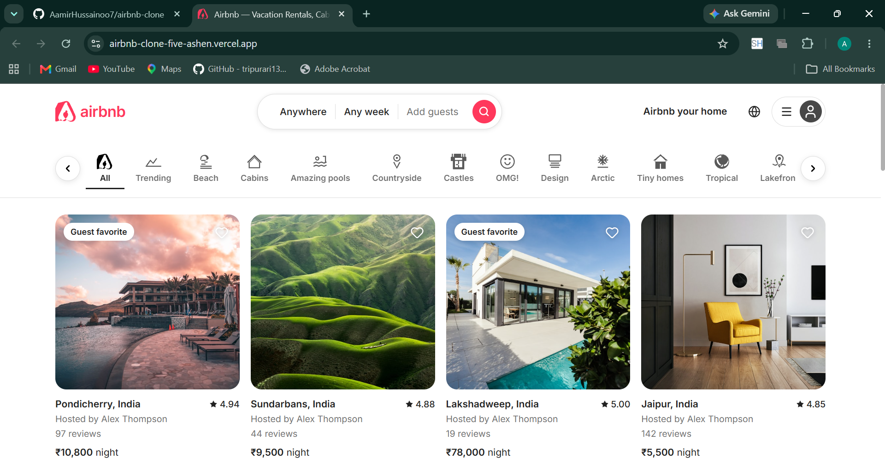
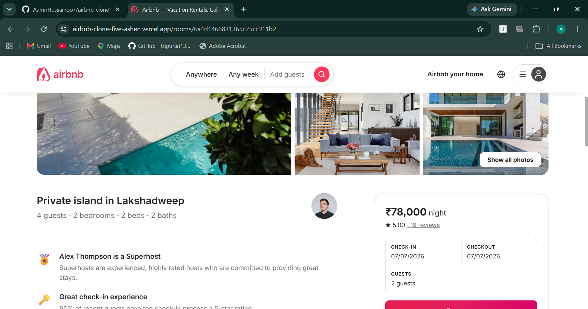
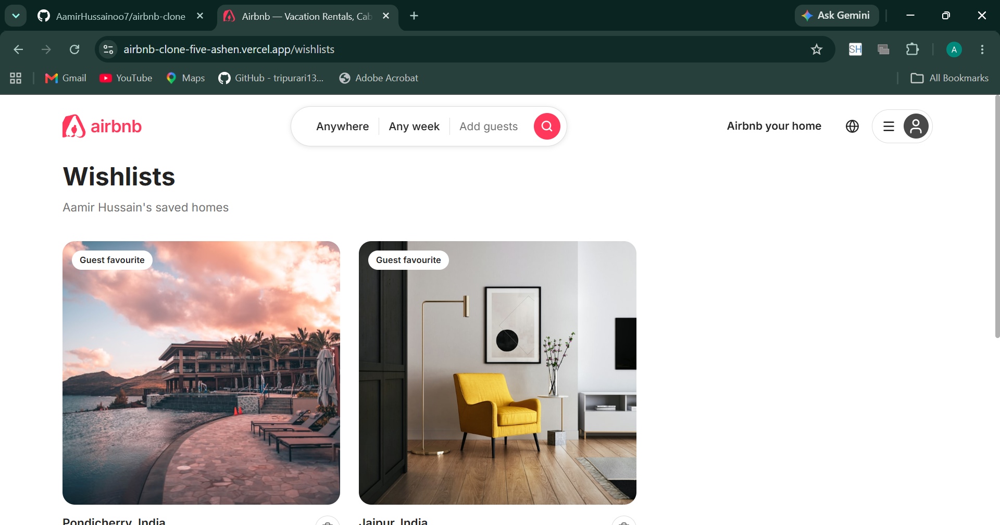

<div align="center">

# 🏡 Airbnb Clone

A full-stack Airbnb-inspired vacation rental platform built with the MERN stack.

[](https://airbnb-clone-five-ashen.vercel.app/)
[](https://airbnb-clone-hn3o.onrender.com/api/health)
[](https://www.mongodb.com/atlas)
[](LICENSE)

**[🌐 View Live App](https://airbnb-clone-five-ashen.vercel.app/)** • **[🔌 API Health Check](https://airbnb-clone-hn3o.onrender.com/api/health)**

</div>

---

## 📸 Overview

A production-ready, full-stack clone of Airbnb featuring property listings, interactive maps, user authentication, booking management, image uploads via Cloudinary, wishlists, and host dashboards — all deployed on a live cloud infrastructure.

---

## 🖼️ Screenshots

### 🏠 Homepage — Browse & Discover Listings


### 🛏️ Room Detail — Full Listing View with Booking


### ❤️ Wishlists — Save Your Favourite Stays


---

## ✨ Features

- 🔐 **Authentication** — Secure register/login with JWT tokens & HTTP-only cookies
- 🏠 **Listings** — Browse, filter by category, search, and view detailed property pages
- 📅 **Booking Engine** — Date-range picker with availability, guest count, and price calculation
- 🗺️ **Interactive Maps** — Leaflet-powered maps showing listing locations
- 🖼️ **Image Uploads** — Multi-image upload via Cloudinary with drag-and-drop support
- ❤️ **Wishlists** — Save and manage favorite listings
- ⭐ **Reviews & Ratings** — Leave reviews and star ratings on stayed properties
- 🎛️ **Host Dashboard** — Manage your own listings, view bookings, and track stats
- ✈️ **Trips Page** — View all upcoming and past bookings
- 📱 **Responsive Design** — Mobile-first, works on all screen sizes

---

## 🛠️ Tech Stack

### Frontend
| Technology | Purpose |
|---|---|
| [React 19](https://react.dev/) | UI Framework |
| [Vite](https://vitejs.dev/) | Build tool & dev server |
| [React Router DOM v7](https://reactrouter.com/) | Client-side routing |
| [Zustand](https://zustand-demo.pmnd.rs/) | Global state management |
| [TanStack Query](https://tanstack.com/query) | Server state & caching |
| [Axios](https://axios-http.com/) | HTTP client |
| [Framer Motion](https://www.framer.com/motion/) | Animations |
| [Leaflet + React Leaflet](https://react-leaflet.js.org/) | Interactive maps |
| [Swiper](https://swiperjs.com/) | Image carousels |
| [Lucide React](https://lucide.dev/) | Icon library |
| [React Hot Toast](https://react-hot-toast.com/) | Notifications |
| [date-fns](https://date-fns.org/) | Date formatting |

### Backend
| Technology | Purpose |
|---|---|
| [Node.js](https://nodejs.org/) + [Express 5](https://expressjs.com/) | REST API server |
| [MongoDB Atlas](https://www.mongodb.com/atlas) + [Mongoose](https://mongoosejs.com/) | Database & ORM |
| [Cloudinary](https://cloudinary.com/) | Image storage & CDN |
| [Multer](https://github.com/expressjs/multer) | File upload handling |
| [JWT](https://jwt.io/) | Stateless authentication |
| [bcryptjs](https://github.com/dcodeIO/bcrypt.js) | Password hashing |
| [Helmet](https://helmetjs.github.io/) | HTTP security headers |
| [Morgan](https://github.com/expressjs/morgan) | HTTP request logger |

### Deployment
| Service | Purpose |
|---|---|
| [Vercel](https://vercel.com/) | Frontend hosting (CDN) |
| [Render](https://render.com/) | Backend hosting |
| [MongoDB Atlas](https://www.mongodb.com/atlas) | Cloud database |
| [Cloudinary](https://cloudinary.com/) | Media storage |

---

## 📂 Project Structure

```
airbnb-clone/
├── 📁 backend/
│   ├── 📁 src/
│   │   ├── 📁 config/          # DB & Cloudinary connection
│   │   ├── 📁 controllers/     # Route handlers (auth, listings, bookings...)
│   │   ├── 📁 middleware/      # Auth guard, error handler, validators
│   │   ├── 📁 models/          # Mongoose schemas (User, Listing, Booking, Review, Wishlist)
│   │   └── 📁 routes/          # Express routers
│   ├── server.js               # App entry point
│   ├── seed.js                 # Database seeder script
│   └── .env.example            # Environment variable template
│
├── 📁 frontend/
│   ├── 📁 src/
│   │   ├── 📁 components/      # Reusable UI (Header, Footer, Auth, ListingCard...)
│   │   ├── 📁 pages/           # Page views (Home, Detail, Trips, Wishlist, Dashboard...)
│   │   ├── 📁 services/        # Axios API service
│   │   └── 📁 store/           # Zustand stores
│   ├── vercel.json             # SPA routing config
│   └── .env.example            # Environment variable template
│
└── README.md
```

---

## 🚀 Getting Started

### Prerequisites
- [Node.js](https://nodejs.org/) v18+
- [MongoDB Atlas](https://www.mongodb.com/atlas) account (free tier works)
- [Cloudinary](https://cloudinary.com/) account (free tier works)

### 1. Clone the Repository

```bash
git clone https://github.com/AamirHussainoo7/airbnb-clone.git
cd airbnb-clone
```

### 2. Setup the Backend

```bash
cd backend
npm install
cp .env.example .env
```

Open `.env` and fill in your values:

```env
MONGO_URI=your_mongodb_atlas_connection_string
JWT_SECRET=your_strong_random_secret
JWT_EXPIRES_IN=7d
CLOUDINARY_CLOUD_NAME=your_cloud_name
CLOUDINARY_API_KEY=your_api_key
CLOUDINARY_API_SECRET=your_api_secret
PORT=5000
NODE_ENV=development
CLIENT_URL=http://localhost:5173
```

Start the backend:
```bash
npm run dev
# Server running at http://localhost:5000
```

#### (Optional) Seed the Database
```bash
npm run seed
```

### 3. Setup the Frontend

```bash
# In a new terminal
cd frontend
npm install
cp .env.example .env
```

The `.env` should contain:
```env
VITE_API_URL=http://localhost:5000/api
```

Start the frontend:
```bash
npm run dev
# App running at http://localhost:5173
```

---

## 🔌 API Reference

Base URL: `https://airbnb-clone-hn3o.onrender.com/api`

| Method | Endpoint | Auth | Description |
|---|---|---|---|
| `GET` | `/health` | No | Health check |
| `POST` | `/auth/register` | No | Register new user |
| `POST` | `/auth/login` | No | Login user |
| `POST` | `/auth/logout` | Yes | Logout user |
| `GET` | `/listings` | No | Get all listings |
| `GET` | `/listings/:id` | No | Get single listing |
| `POST` | `/listings` | Yes | Create listing |
| `PUT` | `/listings/:id` | Yes | Update listing |
| `DELETE` | `/listings/:id` | Yes | Delete listing |
| `GET` | `/bookings` | Yes | Get user bookings |
| `POST` | `/bookings` | Yes | Create booking |
| `DELETE` | `/bookings/:id` | Yes | Cancel booking |
| `GET` | `/reviews/:listingId` | No | Get listing reviews |
| `POST` | `/reviews` | Yes | Add review |
| `GET` | `/wishlists` | Yes | Get user wishlist |
| `POST` | `/wishlists/:listingId` | Yes | Toggle wishlist |
| `POST` | `/upload` | Yes | Upload images to Cloudinary |
| `GET` | `/users/profile` | Yes | Get user profile |
| `PUT` | `/users/profile` | Yes | Update profile |

---

## ☁️ Deployment

### Backend → Render

| Setting | Value |
|---|---|
| Root Directory | `backend` |
| Build Command | `npm install` |
| Start Command | `node server.js` |

**Required Environment Variables on Render:**
```
MONGO_URI, JWT_SECRET, JWT_EXPIRES_IN, CLOUDINARY_CLOUD_NAME,
CLOUDINARY_API_KEY, CLOUDINARY_API_SECRET, NODE_ENV=production,
CLIENT_URL=https://airbnb-clone-five-ashen.vercel.app
```

### Frontend → Vercel

| Setting | Value |
|---|---|
| Root Directory | `frontend` |
| Framework Preset | Vite |
| Build Command | `npm run build` |
| Output Directory | `dist` |

**Required Environment Variables on Vercel:**
```
VITE_API_URL=https://airbnb-clone-hn3o.onrender.com/api
```

> **Note:** The `vercel.json` file in the frontend handles SPA client-side routing automatically — no extra configuration needed.

---

## 🔒 Security

- Passwords hashed with **bcryptjs**
- JWT stored in **HTTP-only cookies** (CSRF-safe) + `Authorization` header fallback
- **Helmet.js** sets secure HTTP headers
- **CORS** restricted to the allowed frontend origin only
- Environment variables never committed to version control

---

## 📄 License

This project is licensed under the ISC License.

---

<div align="center">

Made with ❤️ | [Live Demo →](https://airbnb-clone-five-ashen.vercel.app/)

</div>
